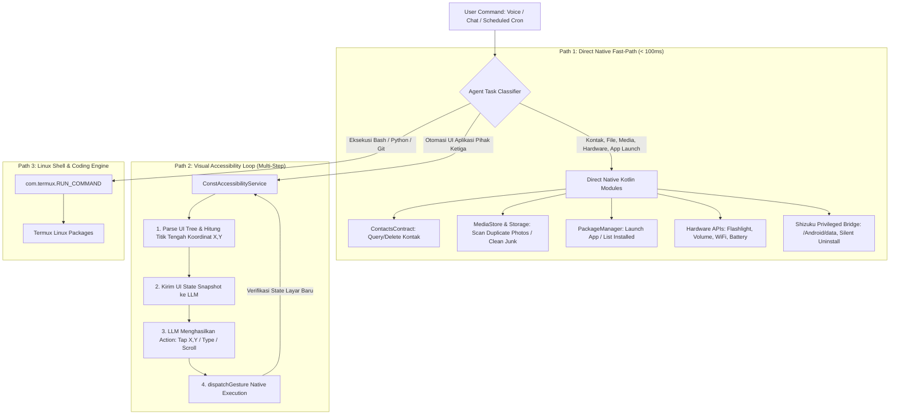
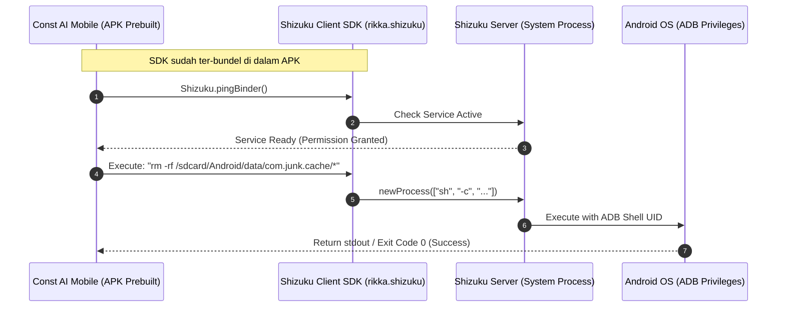
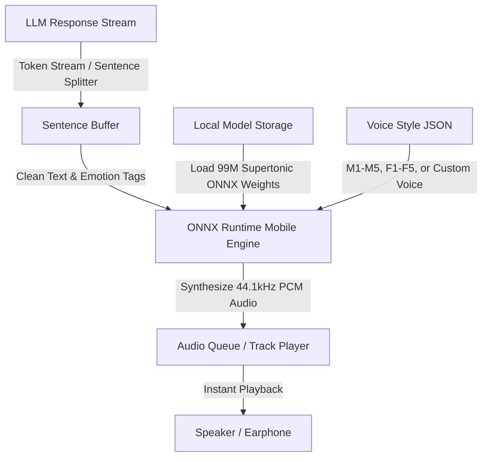

# Const AI Mobile — System Architecture & Blueprint

**Version:** 3.2.0 (On-Device Neural Voice, Android Device OS Operator & Shizuku Privileged Edition)  
**Repository:** `D:/code/platform/const-ai-mobile`  
**Identity:** Personal Assistant + Autonomous Phone OS Operator + Coding Agent + On-Device Voice AI Engine  
**Core Stack:** React Native Expo Prebuild (Custom Native Kotlin Modules) + Next.js 15 Web Dashboard + Convex Real-Time Backend + Supertone Supertonic-3 (Local ONNX TTS) + Shizuku Privileged API & Android Accessibility Service

---

## 1. Executive Summary & Product Vision

Const AI adalah ekosistem AI Agent mandiri multi-fungsi yang menggabungkan lima pilar utama:
1. **Android Device OS Operator (Local Phone Agent)**: Mengelola sistem internal HP secara langsung—membaca dan menghapus kontak, memindai dan membersihkan foto duplikat/screenshot lama, membersihkan file sampah/cache penyimpanan, membuka dan mengelola aplikasi, serta mengontrol setelan hardware HP secara instan.
2. **Autonomous UI Automation (Accessibility Spatial Loop)**: Mengoperasikan aplikasi pihak ketiga (WhatsApp, Gojek, YouTube, Shopee, browser, dll.) secara visual menggunakan *Android Accessibility Service* dengan *Coordinate-Based Spatial Interaction* yang beroperasi secara iteratif (Continuous Feedback Loop).
3. **Privileged System Control (Shizuku Prebuilt Bridge)**: Mengakses folder terproteksi Android modern (`/Android/data`, `/Android/obb`), melakukan *silent uninstall*, membersihkan cache sistem, dan mengeksekusi perintah ADB privileged tanpa memerlukan akses Root.
4. **On-Device Neural Voice Engine (Supertonic-3)**: Sistem Text-to-Speech (TTS) neural lokal berkecepatan tinggi (~99M parameter) yang berjalan di perangkat dengan latensi rendah, tanpa biaya API server, mendukung *emotion tags*, dan *custom voice styles*.
5. **Autonomous Coding & DevOps Agent (Termux & Desktop Companion)**: Menjalankan eksekusi terminal shell bash/zsh, git, node, dan python di lingkungan Linux Termux (Android Standalone) atau Desktop PC Daemon.

---

## 2. Dual-Engine Android Execution Architecture

Untuk kecepatan dan stabilitas maksimal, Const AI membagi eksekusi di Android menjadi dua jalur utama: **Direct Native Fast-Path** dan **Visual Accessibility Loop**.



---

## 3. Shizuku Integration & File System Access (Folder Terkunci)

### A. Apa itu Shizuku dan Kenapa Digunakan?
Pada Android 11 ke atas (Android 11, 12, 13, 14, dan 15), Google membatasi akses ke direktori `/Android/data` dan `/Android/obb` menggunakan *Scoped Storage* dan *Storage Access Framework (SAF)*. Selain itu, uninstal aplikasi standar memerlukan dialog konfirmasi sistem.

Dengan **Shizuku API**, Const AI memperoleh hak istimewa setingkat **ADB Shell** tanpa me-root perangkat:
1. **Membaca & Membersihkan Folder Terkunci:** Mengakses `/sdcard/Android/data` untuk membersihkan sisa cache aplikasi, file sampah game, dan data thumbnail usang.
2. **Silent App Management:** Menghapus atau membekukan bloatware/aplikasi tanpa popup konfirmasi sistem berulang-ulang via `pm uninstall <pkg>` atau `pm disable-user <pkg>`.
3. **Deep System Cache Trimming:** Memanggil `pm trim-caches` untuk mengosongkan RAM dan penyimpanan sistem seketika.



### B. Status "Prebuild" & Pengalaman Pengguna (Zero In-Code Setup):
* **Di Sisi Aplikasi:** Kode Shizuku (`rikka.shizuku:api` dan `rikka.shizuku:provider`) **sudah 100% ter-prebuild di dalam APK Const AI**. Pengguna tidak perlu memodifikasi kode apa pun.
* **Di Sisi Pengguna:** 
  * Pengguna hanya perlu mengaktifkan Shizuku sekali saja di HP menggunakan fitur bawaan Android **Wireless Debugging** (tersedia di Android 11+ di menu Developer Options).
  * Saat pertama kali Const AI dibuka, akan muncul dialog 1x klik: *"Izinkan Const AI mengakses Shizuku"*.
* **Graceful Degradation (Fallback):**
  * Jika Shizuku belum diaktifkan pengguna, Const AI otomatis beralih (*fallback*) ke **Standard Storage Access Framework (SAF)** dan **Android Native APIs**, sehingga aplikasi tetap berfungsi normal untuk semua tugas umum.

---

## 4. Android Accessibility Service & Spatial Coordinates Loop

Terinspirasi dari pendekatan *PrivateAgent* dan arsitektur *Mobile-Agent*, Const AI menyematkan engine otomasi UI tingkat native:

```kotlin
// Contoh Native Kotlin: ConstAccessibilityService.kt
class ConstAccessibilityService : AccessibilityService() {

    // 1. Ekstraksi UI Hierarchy menjadi Spatial Coordinate Map
    fun extractInteractiveElements(): List<UIElement> {
        val elements = mutableListOf<UIElement>()
        val rootNode = rootInActiveWindow ?: return elements
        
        fun traverse(node: AccessibilityNodeInfo) {
            val rect = Rect()
            node.getBoundsInScreen(rect)
            if (node.isClickable || node.isEditable || node.isScrollable) {
                elements.add(UIElement(
                    id = elements.size + 1,
                    text = node.text?.toString() ?: node.contentDescription?.toString() ?: "",
                    className = node.className?.toString() ?: "",
                    bounds = listOf(rect.left, rect.top, rect.right, rect.bottom),
                    centerX = rect.centerX(),
                    centerY = rect.centerY(),
                    isClickable = node.isClickable,
                    isEditable = node.isEditable
                ))
            }
            for (i in 0 until node.childCount) {
                node.getChild(i)?.let { traverse(it) }
            }
        }
        traverse(rootNode)
        return elements
    }

    // 2. Simulasi Tap Berbasis Koordinat (Mendukung Icon Tanpa Teks)
    fun performTap(x: Float, y: Float) {
        val path = Path().apply { moveTo(x, y) }
        val stroke = GestureDescription.StrokeDescription(path, 0, 80)
        val gesture = GestureDescription.Builder().addStroke(stroke).build()
        dispatchGesture(gesture, null, null)
    }
}
```

---

## 5. On-Device Neural Voice Engine (Supertonic-3 Integration)

Sistem suara Const AI dirancang dengan prinsip **Zero API Cost**, **Zero Network Latency**, dan **Privacy/Offline Ready**.



### A. Karakteristik Model
* **Model:** Supertone / Supertonic-3 (~99M Parameters).
* **Format:** ONNX Runtime (`.onnx`) dioptimalkan untuk CPU/NPU perangkat (*NNAPI* di Android, *CoreML* di iOS).
* **Kualitas Audio:** 44.1 kHz 16-bit WAV (Studio Quality).
* **Bahasa:** 31 Bahasa (Multilingual tanpa adapter tambahan).
* **Emotion & Expression Tags:** Mendukung tag natural seperti `<laugh>`, `<breath>`, `<sigh>` yang disisipkan oleh LLM.

---

## 6. 4 Mode Eksekusi & Matriks Keamanan (Governance)

```
┌────────────────────────────────────────────────────────────────────────────────────────┐
│                               4 AGENT OPERATING MODES                                  │
├────────────────────┬────────────────────┬──────────────────────┬───────────────────────┤
│   1. PLAN MODE     │ 2. ASK BEFORE CHG  │ 3. EDIT AUTOMATICALLY│ 4. FULL ACCESS (YOLO) │
│ (Implementation    │ (Strict HITL)      │ (Standard Coding)    │ (Zero Approval)       │
│  Plan First)       │                    │                      │                       │
├────────────────────┼────────────────────┼──────────────────────┼───────────────────────┤
│ - Membuat berkas   │ - Setiap edit file │ - AI langsung edit   │ - Eksekusi instan     │
│   rencana & riset  │   & shell command  │   file & run safe    │   tanpa konfirmasi    │
│ - Menunggu review  │   wajib persetujuan│   command otomatis   │   modal               │
│   user sebelum     │   modal di HP      │ - Hanya prompt untuk │ - Untuk otomasi penuh │
│   mulai coding     │ - Keamanan penuh   │   perintah berisiko  │   dan background task │
└────────────────────┴────────────────────┴──────────────────────┴───────────────────────┘
```

### Android Action Safety Policy:
* 🟢 **Low Risk (Auto-Executed):** Read Contacts, Scan Junk Files, List Installed Apps, Check Battery/WiFi, Launch App, Read Notifications.
* 🟡 **Medium Risk (Prompt in Ask-Mode):** Delete Junk Cache, Delete Duplicate Photos, Send WhatsApp message, Run standard Shell command.
* 🔴 **Critical Risk (Always Prompt / Biometric):** Silent Uninstall System Apps, Format Storage, Transfer/Payment Actions in Banking Apps, Delete Essential Contacts.

---

## 7. High-Level Architecture Diagram

```
┌────────────────────────────────────────────────────────────────────────────────────────┐
│                               WEB CONTROL CENTER (Next.js 15)                          │
│  ┌─────────────────────────┬─────────────────────────┬───────────────────────────────┐ │
│  │   BYOK & Model Picker   │   MCP & Composio Hub    │  Credit Top-Up & Analytics    │ │
│  │  (Gemini, Claude, GPT)  │  (1,000+ App Connectors)│  (Recharts Token / Cost View) │ │
│  ├─────────────────────────┴─────────────────────────┴───────────────────────────────┤ │
│  │                     Voice Persona Gallery & Custom JSON Uploader                  │ │
│  └───────────────────────────────────────────────────────────────────────────────────┘ │
└───────────────────────────────────────────┬────────────────────────────────────────────┘
                                            │
                                            │ WebSocket Reactive Sync
                                            ▼
┌────────────────────────────────────────────────────────────────────────────────────────┐
│                              CONVEX REAL-TIME BACKEND HUB                              │
│  ┌─────────────────────────┬─────────────────────────┬───────────────────────────────┐ │
│  │     Convex Database     │    Scheduled Crons      │       OpenRouter Engine       │ │
│  │  (Reactive Tables/Sync) │  (24/7 Autonomous Tasks)│   (Zero-Markup Token Proxy)   │ │
│  ├─────────────────────────┼─────────────────────────┼───────────────────────────────┤ │
│  │   4-Mode Policy Engine  │   Long-Term Memory DB   │    Web Search & Scraper Hub   │ │
│  │ (Plan/Ask/Edit/FullYOLO)│  (User Preferences/RAG) │   (Anti-Detect Browser/Proxy) │ │
│  └─────────────────────────┴─────────────────────────┴───────────────────────────────┘ │
└───────────────────────────▲───────────────────────────────▲────────────────────────────┘
                            │                               │
        WebSocket Realtime  │                               │ WebSocket Realtime
                            ▼                               ▼
┌──────────────────────────────────────────────┐ ┌────────────────────────────────────────┐
│             ANDROID CLIENT (MVP)             │ │               iOS CLIENT               │
│          (100% Standalone di HP)             │ │       (Life Assistant + PC Companion)  │
├──────────────────────────────────────────────┤ ├────────────────────────────────────────┤
│ - Voice UI (Supertonic ONNX Mobile Engine)   │ │ - Voice UI (Supertonic CoreML Engine)  │
│ - Device OS Operator (Contacts/Media/Junk)   │ │ - In-App Notes & Scheduled Tasks       │
│ - Accessibility Spatial UI Controller        │ │ - Cloud MCP & Composio Operator        │
│ - Shizuku Privileged Bridge (/Android/data)  │ │ - Remote PC Terminal & Code Control    │
│ - Termux CLI Runner (Node, Python, Git)      │ └───────────────────▲────────────────────┘
│ - In-App Notes & Notification Listener       │                     │
└──────────────────────────────────────────────┘    Zero-Trust Relay │ (Convex Relay / WebRTC)
                                                                     ▼
                                                 ┌────────────────────────────────────────┐
                                                 │          DESKTOP DAEMON (PC)           │
                                                 │        (Windows / macOS / Linux)       │
                                                 ├────────────────────────────────────────┤
                                                 │ - Local Shell Execution (Bash/PowerSh) │
                                                 │ - File System Access for Coding Proj   │
                                                 │ - CLI Runner (Git, Docker, Compilers)  │
                                                 └────────────────────────────────────────┘
```

---

## 8. Complete Convex Database Schema (`schema.ts`)

```typescript
import { defineSchema, defineTable } from "convex/server";
import { v } from "convex/values";

export default defineSchema({
  // 1. Users & Subscription
  users: defineTable({
    email: v.string(),
    name: v.string(),
    avatarUrl: v.optional(v.string()),
    subscriptionStatus: v.union(v.literal("active"), v.literal("expired"), v.literal("pending_payment")),
    subscriptionPlan: v.union(v.literal("monthly"), v.literal("quarterly"), v.literal("yearly")),
    subscriptionExpiresAt: v.number(),
    creditsBalanceUsd: v.number(),
    createdAt: v.number(),
  }).index("by_email", ["email"]),

  // 2. User Configuration & Operating Mode + Voice Settings
  userConfigs: defineTable({
    userId: v.id("users"),
    inferenceMode: v.union(v.literal("byok"), v.literal("managed_credits")),
    activeModel: v.string(),
    operatingMode: v.union(
      v.literal("normal_mode"),
      v.literal("ask_before_change"),
      v.literal("plan_mode"),
      v.literal("full_access_yolo")
    ),
    customApiKeys: v.object({
      gemini: v.optional(v.string()),
      anthropic: v.optional(v.string()),
      openAi: v.optional(v.string()),
      openRouter: v.optional(v.string()),
    }),
    sessionSpendCapUsd: v.number(),
    systemPersona: v.string(),
    timezone: v.string(),
    temperature: v.number(),
    
    // Voice & TTS Configuration
    voiceSettings: v.object({
      ttsEngine: v.union(v.literal("local_supertonic"), v.literal("cloud_fallback")),
      selectedVoiceStyle: v.string(),
      speakingRate: v.number(),
      enableEmotionTags: v.boolean(),
      autoPlayVoiceResponse: v.boolean(),
      customVoiceStyleId: v.optional(v.id("voiceStyles")),
    }),
  }).index("by_user", ["userId"]),

  // 3. Custom Voice Styles & Presets
  voiceStyles: defineTable({
    userId: v.optional(v.id("users")),
    name: v.string(),
    styleKey: v.string(),
    isPreset: v.boolean(),
    description: v.optional(v.string()),
    styleJson: v.string(),
    createdAt: v.number(),
  }).index("by_user", ["userId"]),

  // 4. Long-Term Memory (User Context & Preferences)
  memories: defineTable({
    userId: v.id("users"),
    key: v.string(),
    value: v.string(),
    category: v.union(v.literal("preference"), v.literal("fact"), v.literal("system_instruction")),
    updatedAt: v.number(),
  }).index("by_user_key", ["userId", "key"]),

  // 5. Registered Devices & Pairings
  devices: defineTable({
    userId: v.id("users"),
    deviceName: v.string(),
    platform: v.union(v.literal("android"), v.literal("ios"), v.literal("windows"), v.literal("macos"), v.literal("linux")),
    deviceRole: v.union(v.literal("standalone_host"), v.literal("remote_client"), v.literal("desktop_runner")),
    publicKey: v.string(),
    isOnline: v.boolean(),
    lastPingAt: v.number(),
    localModelDownloaded: v.optional(v.boolean()),
    shizukuActive: v.optional(v.boolean()),
    accessibilityActive: v.optional(v.boolean()),
  }).index("by_user", ["userId"]),

  devicePairings: defineTable({
    userId: v.id("users"),
    clientDeviceId: v.id("devices"),
    runnerDeviceId: v.id("devices"),
    status: v.union(v.literal("active"), v.literal("paused"), v.literal("revoked")),
    allowedPaths: v.array(v.string()),
    createdAt: v.number(),
  }).index("by_client", ["clientDeviceId"]),

  // 6. Conversations & Chat Threads
  conversations: defineTable({
    userId: v.id("users"),
    title: v.string(),
    isPinned: v.boolean(),
    currentPlanId: v.optional(v.id("implementationPlans")),
    targetRunnerDeviceId: v.optional(v.id("devices")),
    createdAt: v.number(),
    updatedAt: v.number(),
  }).index("by_user_updated", ["userId", "updatedAt"]),

  // 7. Implementation Plans (For Plan Mode)
  implementationPlans: defineTable({
    conversationId: v.id("conversations"),
    goal: v.string(),
    proposedChanges: v.array(v.object({
      filePath: v.string(),
      action: v.union(v.literal("create"), v.literal("modify"), v.literal("delete")),
      explanation: v.string(),
    })),
    verificationSteps: v.array(v.string()),
    status: v.union(v.literal("draft"), v.literal("approved"), v.literal("in_progress"), v.literal("completed")),
    createdAt: v.number(),
  }).index("by_conversation", ["conversationId"]),

  // 8. Messages & Tool Streams
  messages: defineTable({
    conversationId: v.id("conversations"),
    role: v.union(v.literal("user"), v.literal("assistant"), v.literal("system"), v.literal("tool")),
    content: v.string(),
    toolCalls: v.optional(v.array(v.object({
      id: v.string(),
      toolName: v.string(),
      args: v.any(),
      result: v.optional(v.any()),
      policyDecision: v.union(v.literal("allow"), v.literal("ask"), v.literal("deny")),
      status: v.union(v.literal("running"), v.literal("waiting_hitl"), v.literal("success"), v.literal("failed")),
    }))),
    modelUsed: v.optional(v.string()),
    promptTokens: v.optional(v.number()),
    completionTokens: v.optional(v.number()),
    costUsd: v.optional(v.number()),
    createdAt: v.number(),
  }).index("by_conversation", ["conversationId"]),

  // 9. Human-in-the-Loop (HITL) Action Queue
  pendingActions: defineTable({
    userId: v.id("users"),
    conversationId: v.id("conversations"),
    targetDeviceId: v.id("devices"),
    toolName: v.string(),
    actionType: v.union(v.literal("shell_command"), v.literal("device_control"), v.literal("file_delete")),
    command: v.string(),
    workingDir: v.optional(v.string()),
    diffContent: v.optional(v.string()),
    status: v.union(v.literal("pending"), v.literal("approved"), v.literal("rejected")),
    stdout: v.optional(v.string()),
    stderr: v.optional(v.string()),
    createdAt: v.number(),
  }).index("by_target_device_status", ["targetDeviceId", "status"]),

  // 10. Scheduled Tasks (Crons with MCP & Composio)
  scheduledTasks: defineTable({
    userId: v.id("users"),
    title: v.string(),
    promptInstruction: v.string(),
    cronExpression: v.string(),
    attachedMcpTools: v.array(v.string()),
    isActive: v.boolean(),
    lastRunAt: v.optional(v.number()),
    nextRunAt: v.number(),
  }).index("by_user", ["userId"]),

  // 11. Notes & Reminders
  notes: defineTable({
    userId: v.id("users"),
    title: v.string(),
    content: v.string(),
    tags: v.array(v.string()),
    isSyncedToNativeApp: v.boolean(),
    createdAt: v.number(),
    updatedAt: v.number(),
  }).index("by_user", ["userId"]),

  // 12. Usage Analytics & Cost Tracking
  usageLogs: defineTable({
    userId: v.id("users"),
    model: v.string(),
    promptTokens: v.number(),
    completionTokens: v.number(),
    costUsd: v.number(),
    inferenceSource: v.union(v.literal("byok"), v.literal("managed_credits")),
    timestamp: v.number(),
  }).index("by_user_timestamp", ["userId", "timestamp"]),
});
```

---

## 9. Monorepo Structure (Turborepo)

```text
const-ai-mobile/
├── apps/
│   ├── mobile/                          # React Native (Expo Prebuild / Native Modules)
│   │   ├── android/                     # Prebuilt Android Native Layer
│   │   │   └── app/src/main/java/com/constai/mobile/
│   │   │       ├── accessibility/       # ConstAccessibilityService & UI Spatial Parser
│   │   │       ├── shizuku/             # Shizuku Privileged Bridge (/Android/data, silent uninstall)
│   │   │       ├── device/              # DeviceOperator (Contacts, MediaStore, Junk Cleaner)
│   │   │       └── termux/              # TermuxIntentBridge & Terminal TCP Socket
│   │   ├── app/                         # Expo Router (Chat, Terminal, Device, Voice, Settings)
│   │   ├── components/
│   │   │   ├── voice/                   # VoiceVisualizer, ModelDownloaderModal, VoiceStylePicker
│   │   │   ├── terminal/                # In-App Termux View & Shell Stream
│   │   │   ├── device/                  # Device Clean Cards, Contact Sync, Shizuku Status Badge
│   │   │   └── hitl/                    # Approval Modal & Plan Card
│   │   ├── services/
│   │   │   ├── voice/                   # Supertonic ONNX runner & Audio Queue
│   │   │   ├── device/                  # Native Device Bridge Wrapper
│   │   │   └── accessibility/           # UI Automation Coordinator
│   │   └── package.json
│   │
│   ├── web/                             # Next.js 15 Web Dashboard
│   │   ├── app/                         # App Router (BYOK, Credit Top-Up, MCP Hub, Analytics)
│   │   ├── components/                  # Shadcn UI, Voice Persona Uploader, Recharts Cost View
│   │   └── package.json
│   │
│   └── desktop-daemon/                  # PC Runner (Node.js CLI / Native Runner)
│       └── src/                         # Shell Execution & Zero-Trust QR Pairing
│
├── packages/
│   ├── backend/                         # Convex Realtime Hub (Single Source of Truth)
│   │   ├── convex/
│   │   │   ├── schema.ts                # Unified Database Schema
│   │   │   ├── agent.ts                 # Agent Core & Device Function Calling Tools
│   │   │   ├── voice.ts                 # Voice Style Manager & Presets Resolver
│   │   │   ├── crons.ts                 # Scheduled Task Processor
│   │   │   └── policyEngine.ts          # 4 Operating Modes Evaluator
│   │   └── package.json
│   │
│   ├── types/                           # Shared TypeScript Definitions & Interfaces
│   └── config/                          # Shared Configuration
│
├── turbo.json                           # Turborepo Build Pipeline Orchestration
├── pnpm-workspace.yaml                  # PNPM Workspace Configuration
├── package.json                         # Root Dependencies & Scripts
└── README.md
```
