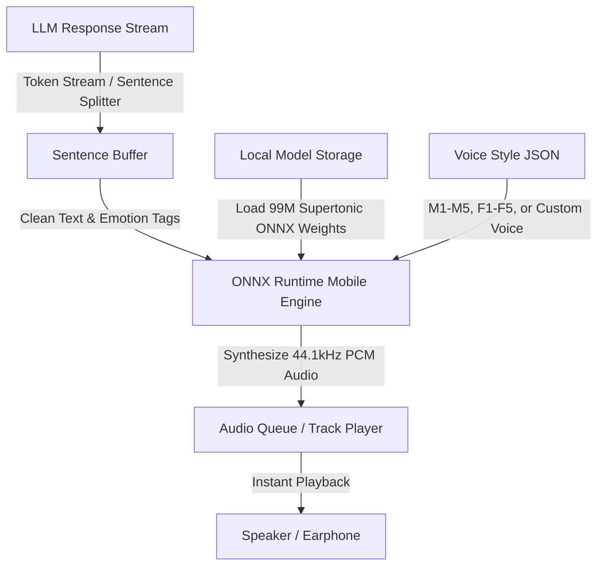
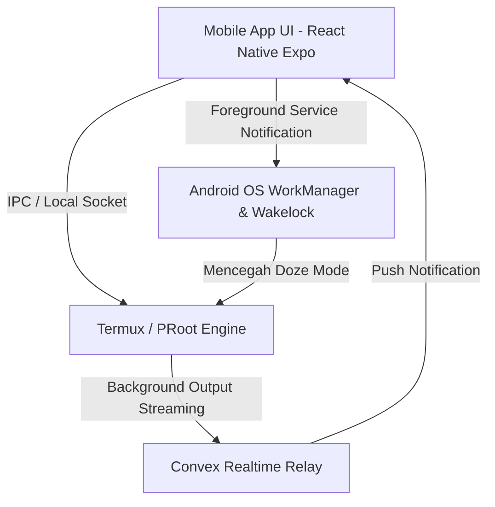

# Const AI Mobile — System Architecture & Blueprint
**Version:** 3.1.0 (JARVIS, On-Device Neural Voice & Autonomous Developer Edition)  
**Repository:** `D:/code/platform/const-ai-mobile`  
**Identity:** Personal Life Assistant + Autonomous Coding Agent + Personal JARVIS + On-Device Voice AI  
**Core Stack:** React Native Expo (Android Standalone + iOS Companion) + Next.js 16 Web Dashboard + Convex Real-Time Backend + Supertone Supertonic-3 (Local ONNX TTS)

---

## 1. Executive Summary & Product Vision

**Const AI** adalah ekosistem AI Agent mandiri multi-guna yang menggabungkan empat pilar utama:
1. **Personal Life Assistant (JARVIS)**: Mengelola jadwal harian, merangkum email, pengingat cerdas, pencatatan otomatis, dan interaksi percakapan natural.
2. **On-Device Neural Voice Engine (Supertonic-3)**: Sistem Text-to-Speech (TTS) lokal neural berkecepatan tinggi (~99M params) yang berjalan 100% di HP dengan latensi nol, bebas biaya API server, mendukung *emotion tags*, dan *custom voice styles*.
3. **Autonomous Coding & DevOps Agent**: Menulis kode, membaca repositori Git, menjalankan build, mengedit file secara otomatis, dan mengeksekusi terminal shell.
4. **Background Automation Engine**: Menjalankan tugas terjadwal (*Scheduled Tasks*) 24/7 di latar belakang menggunakan Convex Cron, MCP, dan Composio.

---

## 2. On-Device Neural Voice Engine (Supertonic-3 Integration)

Sistem suara Const AI dirancang dengan prinsip **Zero API Cost**, **Zero Network Latency**, dan **100% Privacy/Offline Ready**.



### A. Karakteristik Model
* **Model:** Supertone / Supertonic-3 (~99M Parameters).
* **Format:** ONNX Runtime (`.onnx`) dioptimalkan untuk CPU/NPU HP (*NNAPI* di Android, *CoreML* di iOS).
* **Kualitas Audio:** 44.1 kHz 16-bit WAV (Studio Quality).
* **Bahasa:** 31 Bahasa (Multilingual tanpa adapter tambahan).
* **Emotion & Expression Tags:** Mendukung tag natural seperti `<laugh>`, `<breath>`, `<sigh>` yang dapat disisipkan langsung oleh LLM dalam prompt percakapan.

### B. Strategi On-Demand Model Download (Asset Manager)
* **Ukuran APK/IPA Ramping:** File installer aplikasi tetap berukuran kecil (<50 MB) tanpa membundel file bobot model secara langsung.
* **In-App Model Downloader:**
  * Saat pertama kali pengguna mengaktifkan Voice Mode atau di menu Onboarding/Settings, aplikasi menyediakan dialog: *"Download JARVIS Voice Pack (~250 MB) untuk suara instan & hemat kuota."*
  * Model diunduh dari CDN/Hugging Face sekali saja ke `FileSystem.documentDirectory` dengan indikator *download progress* dan verifikasi *SHA-256 Checksum*.
* **Status Model:** Tersimpan di storage lokal perangkat dan dicatat statusnya di konfigurasi pengguna.

### C. Custom Voice System & Presets
* **Preset Suara Bawaan:**
  * `M1` / `M2`: Persona **JARVIS** (British/Formal Male).
  * `F1` / `F2`: Persona **FRIDAY** (Friendly Assistant Female).
  * `M3–M5` & `F3–F5`: Persona Casual, Storyteller, & Energetic.
* **Custom Voice Styles:**
  * File *voice style* Supertonic berukuran sangat kecil (**JSON ~beberapa KB**).
  * Pengguna dapat mengimpor file `voice_style.json` kustom mereka sendiri, atau memilih dari galeri persona suara di Web Control Center / Mobile App.

---

## 3. Analisis iOS & Strategi Companion

### Bagaimana "Boop" Menangani iOS?
Di video Chris Raroque:
* Server/engine Boop **sebenarnya di-host di Mac / Cloud**, dan Chris berbicara dengannya dari iPhone melalui **iMessage / SMS webhook**.
* Mac mengeksekusi AppleScript lokal, browser automation, dan terminal, lalu mengirimkan balasannya ke iPhone.

### Strategi Const AI untuk iOS:
* **Jika iOS Standalone (Tanpa Mac/PC)**: Pengguna iPhone tetap bisa menggunakan **90% fitur JARVIS & Life Assistant**: Chat, Natural Voice (Supertonic via CoreML), Natural Language Settings, Notes, Scheduled Tasks (Composio: Gmail, Notion, Calendar), Web Search, dan Analisis Data. Fitur yang terbatas hanyalah eksekusi terminal shell mesin lokal.
* **Jika iOS Terhubung ke Mac/PC (Remote Companion)**: Begitu di-pair via QR Code ke Mac/PC, iPhone memiliki **100% kapabilitas Coding Agent & Terminal PC** dari jarak jauh!

---

## 4. 4 Mode Eksekusi & Keamanan (Agent Operating Modes)

Pengguna dapat memilih atau mengganti mode kerja agent kapan saja melalui Chat atau Web Dashboard:

```
┌────────────────────────────────────────────────────────────────────────────────────────┐
│                               4 AGENT OPERATING MODES                                  │
├────────────────────┬────────────────────┬──────────────────────┬───────────────────────┤
│   1. PLAN MODE     │ 2. ASK BEFORE CHG  │ 3. EDIT AUTOMATICALLY│ 4. FULL ACCESS (YOLO) │
│ (Implementation    │ (Strict HITL)      │ (Standard Coding)    │ (Zero Approval)       │
│  Plan First)       │                    │                      │                       │
├────────────────────┼────────────────────┼──────────────────────┼───────────────────────┤
│ • Membuat file     │ • Setiap edit file │ • AI langsung edit   │ • Eksekusi instan     │
│   rencana & riset  │   & shell command  │   file & run safe    │   tanpa prompt atau   │
│ • Menunggu review  │   wajib persetujuan│   command otomatis   │   konfirmasi modal    │
│   user sebelum     │   modal di HP      │ • Hanya prompt untuk │ • Untuk otomasi penuh │
│   mulai coding     │ • Keamanan penuh   │   perintah bahaya    │   dan task background │
└────────────────────┴────────────────────┴──────────────────────┴───────────────────────┘
```

---

## 5. Android Termux Terminal & Background Service Architecture

Agar terminal di Android dapat berjalan terus menerus di latar belakang tanpa dimatikan oleh sistem operasi:



1. **Integrated In-App Terminal View**: Tab terminal khusus di dalam aplikasi mobile untuk memantau langsung output shell bash/zsh, npm, python, dan `omniroute`.
2. **Android Foreground Service**: Menampilkan notifikasi persisten di status bar (*"Const AI Agent is running in background"*) sehingga task kompilasi atau cron tidak dibunuh oleh OS Android.
3. **Wakelock Management**: Menjaga CPU tetap aktif saat mengeksekusi long-running build task.

---

## 6. Natural Language Settings & Long-Term Memory

Pengguna dapat mengubah konfigurasi sistem langsung melalui bahasa percakapan sehari-hari di chat:

* **Contoh Perintah Chat:**
  * *"Const, ganti suara ke persona FRIDAY F1"* → Memanggil mutation `userConfigs.updateVoiceStyle`.
  * *"Ganti model AI aktif ke Claude 3.7 Sonnet ya"* → Memanggil mutation `userConfigs.updateModel`.
  * *"Mulai sekarang ubah mode kerja ke Plan Mode"* → Memanggil mutation `userConfigs.updateMode`.
  * *"Set limit budget sesi ini maksimal $1"* → Memanggil mutation `userConfigs.updateSpendCap`.
  * *"Ingat bahwa saya selalu prefer framework Tailwind dan Expo"* → Menyimpan ke tabel `memories`.

---

## 7. High-Level Architecture Diagram

```
┌────────────────────────────────────────────────────────────────────────────────────────┐
│                               WEB CONTROL CENTER (Next.js 16)                          │
│  ┌─────────────────────────┬─────────────────────────┬───────────────────────────────┐ │
│  │   BYOK & Model Picker   │   MCP & Composio Hub    │  Credit Top-Up & Analytics    │ │
│  │  (Gemini, Claude, GPT)  │  (1,000+ App Connectors)│  (Recharts Token / Cost View) │ │
│  ├─────────────────────────┴─────────────────────────┴───────────────────────────────┤ │
│  │                     Voice Persona Gallery & Custom JSON Uploader                  │ │
│  └───────────────────────────────────────────────────────────────────────────────────┘ │
└───────────────────────────────────────────┬────────────────────────────────────────────┘
                                            │
                                            │ WebSocket Reactive Sync
                                            ▼
┌────────────────────────────────────────────────────────────────────────────────────────┐
│                              CONVEX REAL-TIME BACKEND HUB                              │
│  ┌─────────────────────────┬─────────────────────────┬───────────────────────────────┐ │
│  │     Convex Database     │    Scheduled Crons      │       OpenRouter Engine       │ │
│  │  (Reactive Tables/Sync) │  (24/7 Autonomous Tasks)│   (Zero-Markup Token Proxy)   │ │
│  ├─────────────────────────┼─────────────────────────┼───────────────────────────────┤ │
│  │   4-Mode Policy Engine  │   Long-Term Memory DB   │    Stealth Web Browser Hub    │ │
│  │ (Plan/Ask/Edit/FullYOLO)│  (User Preferences/RAG) │   (Anti-Detect Patchright)    │ │
│  └─────────────────────────┴─────────────────────────┴───────────────────────────────┘ │
└───────────────────────────▲───────────────────────────────▲────────────────────────────┘
                            │                               │
        WebSocket Realtime  │                               │ WebSocket Realtime
                            ▼                               ▼
┌──────────────────────────────────────────────┐ ┌────────────────────────────────────────┐
│             ANDROID CLIENT (MVP)             │ │               iOS CLIENT               │
│          (100% Standalone di HP)             │ │       (Life Assistant + PC Companion)  │
├──────────────────────────────────────────────┤ ├────────────────────────────────────────┤
│ • JARVIS Voice UI (Supertonic ONNX Mobile)   │ │ • JARVIS Voice UI (Supertonic CoreML)  │
│ • In-App Model & Voice Pack Manager          │ │ • In-App Model & Voice Pack Manager    │
│ • Embedded Termux View & Background Service  │ │ • In-App Notes & Scheduled Tasks       │
│ • Local File System & Contact/Calendar Bridge│ │ • Cloud MCP & Composio Operator        │
│ • In-App Notes & Scheduled Task Notifications│ │ • Remote PC Terminal & Code Control    │
└──────────────────────────────────────────────┘ └───────────────────▲────────────────────┘
                                                                     │
                                                    Zero-Trust Relay │ (Convex Relay / WebRTC)
                                                                     ▼
                                                 ┌────────────────────────────────────────┐
                                                 │          DESKTOP DAEMON (PC)           │
                                                 │        (Windows / macOS / Linux)       │
                                                 ├────────────────────────────────────────┤
                                                 │ • Local Shell Execution (Bash/PowerSh) │
                                                 │ • File System Access for Coding Proj   │
                                                 │ • CLI Runner (`omniroute`, Git, Docker)│
                                                 └────────────────────────────────────────┘
```

---

## 8. Complete Convex Database Schema (`schema.ts`)

```typescript
import { defineSchema, defineTable } from "convex/server";
import { v } from "convex/values";

export default defineSchema({
  // 1. Users & Subscription
  users: defineTable({
    email: v.string(),
    name: v.string(),
    avatarUrl: v.optional(v.string()),
    subscriptionStatus: v.union(v.literal("active"), v.literal("expired"), v.literal("pending_payment")),
    subscriptionPlan: v.union(v.literal("monthly"), v.literal("quarterly"), v.literal("yearly")),
    subscriptionExpiresAt: v.number(),
    creditsBalanceUsd: v.number(), // Saldo kredit OpenRouter tanpa markup
    createdAt: v.number(),
  }).index("by_email", ["email"]),

  // 2. User Configuration & Operating Mode + Voice Settings
  userConfigs: defineTable({
    userId: v.id("users"),
    inferenceMode: v.union(v.literal("byok"), v.literal("managed_credits")),
    activeModel: v.string(), // e.g. "google/gemini-2.5-flash", "anthropic/claude-3.7-sonnet"
    operatingMode: v.union(
      v.literal("plan_mode"),
      v.literal("ask_before_change"),
      v.literal("edit_automatically"),
      v.literal("full_access_yolo")
    ),
    customApiKeys: v.object({
      gemini: v.optional(v.string()),
      anthropic: v.optional(v.string()),
      openAi: v.optional(v.string()),
      openRouter: v.optional(v.string()),
    }),
    sessionSpendCapUsd: v.number(), // Maksimal budget per sesi
    systemPersona: v.string(), // JARVIS persona prompt
    timezone: v.string(),
    temperature: v.number(),
    
    // Voice & TTS Configuration
    voiceSettings: v.object({
      ttsEngine: v.union(v.literal("local_supertonic"), v.literal("cloud_fallback")),
      selectedVoiceStyle: v.string(), // e.g. "JARVIS_M1", "FRIDAY_F1", or custom style key
      speakingRate: v.number(),       // default: 1.0 (range: 0.5 - 2.0)
      enableEmotionTags: v.boolean(),  // true: enable <laugh>, <breath>, <sigh>
      autoPlayVoiceResponse: v.boolean(),
      customVoiceStyleId: v.optional(v.id("voiceStyles")),
    }),
  }).index("by_user", ["userId"]),

  // 3. Custom Voice Styles & Presets
  voiceStyles: defineTable({
    userId: v.optional(v.id("users")), // undefined = global system preset
    name: v.string(),                  // e.g. "JARVIS British", "FRIDAY Friendly"
    styleKey: v.string(),              // "M1", "F1", "CUSTOM_USER_VOICE"
    isPreset: v.boolean(),             // true jika preset bawaan Supertonic
    description: v.optional(v.string()),
    styleJson: v.string(),             // Raw JSON string bobot style embedding Supertonic
    createdAt: v.number(),
  }).index("by_user", ["userId"]),

  // 4. Long-Term Memory (User Context & Preferences)
  memories: defineTable({
    userId: v.id("users"),
    key: v.string(), // e.g. "preferred_tech_stack", "birthday", "work_hours"
    value: v.string(),
    category: v.union(v.literal("preference"), v.literal("fact"), v.literal("system_instruction")),
    updatedAt: v.number(),
  }).index("by_user_key", ["userId", "key"]),

  // 5. Registered Devices & Pairings
  devices: defineTable({
    userId: v.id("users"),
    deviceName: v.string(),
    platform: v.union(v.literal("android"), v.literal("ios"), v.literal("windows"), v.literal("macos"), v.literal("linux")),
    deviceRole: v.union(v.literal("standalone_host"), v.literal("remote_client"), v.literal("desktop_runner")),
    publicKey: v.string(),
    isOnline: v.boolean(),
    lastPingAt: v.number(),
    localModelDownloaded: v.optional(v.boolean()), // Status apakah model ONNX sudah diunduh di HP
  }).index("by_user", ["userId"]),

  devicePairings: defineTable({
    userId: v.id("users"),
    clientDeviceId: v.id("devices"),
    runnerDeviceId: v.id("devices"),
    status: v.union(v.literal("active"), v.literal("paused"), v.literal("revoked")),
    allowedPaths: v.array(v.string()),
    createdAt: v.number(),
  }).index("by_client", ["clientDeviceId"]),

  // 6. Conversations & Chat Threads
  conversations: defineTable({
    userId: v.id("users"),
    title: v.string(),
    isPinned: v.boolean(),
    currentPlanId: v.optional(v.id("implementationPlans")),
    targetRunnerDeviceId: v.optional(v.id("devices")),
    createdAt: v.number(),
    updatedAt: v.number(),
  }).index("by_user_updated", ["userId", "updatedAt"]),

  // 7. Implementation Plans (For Plan Mode)
  implementationPlans: defineTable({
    conversationId: v.id("conversations"),
    goal: v.string(),
    proposedChanges: v.array(v.object({
      filePath: v.string(),
      action: v.union(v.literal("create"), v.literal("modify"), v.literal("delete")),
      explanation: v.string(),
    })),
    verificationSteps: v.array(v.string()),
    status: v.union(v.literal("draft"), v.literal("approved"), v.literal("in_progress"), v.literal("completed")),
    createdAt: v.number(),
  }).index("by_conversation", ["conversationId"]),

  // 8. Messages & Tool Streams
  messages: defineTable({
    conversationId: v.id("conversations"),
    role: v.union(v.literal("user"), v.literal("assistant"), v.literal("system"), v.literal("tool")),
    content: v.string(),
    toolCalls: v.optional(v.array(v.object({
      id: v.string(),
      toolName: v.string(),
      args: v.any(),
      result: v.optional(v.any()),
      policyDecision: v.union(v.literal("allow"), v.literal("ask"), v.literal("deny")),
      status: v.union(v.literal("running"), v.literal("waiting_hitl"), v.literal("success"), v.literal("failed")),
    }))),
    modelUsed: v.optional(v.string()),
    promptTokens: v.optional(v.number()),
    completionTokens: v.optional(v.number()),
    costUsd: v.optional(v.number()),
    createdAt: v.number(),
  }).index("by_conversation", ["conversationId"]),

  // 9. Human-in-the-Loop (HITL) Action Queue
  pendingActions: defineTable({
    userId: v.id("users"),
    conversationId: v.id("conversations"),
    targetDeviceId: v.id("devices"),
    toolName: v.string(),
    command: v.string(),
    workingDir: v.optional(v.string()),
    diffContent: v.optional(v.string()),
    status: v.union(v.literal("pending"), v.literal("approved"), v.literal("rejected")),
    stdout: v.optional(v.string()),
    stderr: v.optional(v.string()),
    createdAt: v.number(),
  }).index("by_target_device_status", ["targetDeviceId", "status"]),

  // 10. Scheduled Tasks (Crons with MCP & Composio)
  scheduledTasks: defineTable({
    userId: v.id("users"),
    title: v.string(),
    promptInstruction: v.string(),
    cronExpression: v.string(),
    attachedMcpTools: v.array(v.string()),
    isActive: v.boolean(),
    lastRunAt: v.optional(v.number()),
    nextRunAt: v.number(),
  }).index("by_user", ["userId"]),

  // 11. Notes & Reminders
  notes: defineTable({
    userId: v.id("users"),
    title: v.string(),
    content: v.string(),
    tags: v.array(v.string()),
    isSyncedToNativeApp: v.boolean(),
    createdAt: v.number(),
    updatedAt: v.number(),
  }).index("by_user", ["userId"]),

  // 12. Usage Analytics & Cost Tracking
  usageLogs: defineTable({
    userId: v.id("users"),
    model: v.string(),
    promptTokens: v.number(),
    completionTokens: v.number(),
    costUsd: v.number(),
    inferenceSource: v.union(v.literal("byok"), v.literal("managed_credits")),
    timestamp: v.number(),
  }).index("by_user_timestamp", ["userId", "timestamp"]),
});
```

---

## 9. Monorepo Structure (Turborepo)

Struktur monorepo resmi untuk menyatukan Mobile, Web, dan Backend dalam 1 Git repository:

```
const-ai-mobile/
├── apps/
│   ├── mobile/                          # React Native (Expo) - Android & iOS
│   │   ├── app/                         # Expo Router (Chat, Terminal, Voice, Settings)
│   │   ├── components/
│   │   │   ├── voice/                   # VoiceVisualizer, ModelDownloaderModal, VoiceStylePicker
│   │   │   ├── terminal/                # In-App Termux View & Shell Stream
│   │   │   └── hitl/                    # Approval Modal & Plan Card
│   │   ├── services/
│   │   │   ├── voice/                   # Supertonic ONNX runner & Audio Queue (`onnxruntime-react-native`)
│   │   │   └── termux/                  # Android Foreground Service & Local Socket Bridge
│   │   └── package.json
│   │
│   ├── web/                             # Next.js 16 Web Dashboard
│   │   ├── app/                         # App Router (BYOK, Credit Top-Up, MCP Hub, Analytics)
│   │   ├── components/                  # Shadcn UI, Voice Persona Uploader, Recharts Cost View
│   │   └── package.json
│   │
│   └── desktop-daemon/                  # PC Runner (Tauri / Node.js CLI)
│       └── src/                         # Shell Execution & Zero-Trust QR Pairing
│
├── packages/
│   ├── backend/                         # Convex Realtime Hub (Single Source of Truth)
│   │   ├── convex/
│   │   │   ├── schema.ts                # Unified Database Schema
│   │   │   ├── agent.ts                 # JARVIS Core & NL Settings Handler
│   │   │   ├── voice.ts                 # Voice Style Manager & Presets Resolver
│   │   │   ├── crons.ts                 # Scheduled Task Processor
│   │   │   └── policyEngine.ts          # 4 Operating Modes Evaluator
│   │   └── package.json
│   │
│   ├── types/                           # Shared TypeScript Definitions & Interfaces
│   └── config/                          # Shared ESLint & TSConfig
│
├── turbo.json                           # Turborepo Build Pipeline Orchestration
├── pnpm-workspace.yaml                  # PNPM Workspace Configuration
├── package.json                         # Root Dependencies & Scripts
└── README.md
```
