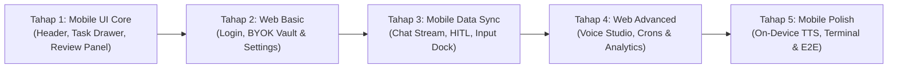

# Granular Implementation Breakdown & Spiral Roadmap: Const AI Mobile

> **Execution Strategy:** Iterative Spiral Approach (Mobile UI ➔ Web Basic ➔ Mobile Integration ➔ Web Advanced ➔ Mobile Polish & E2E)  
> **Current Status:** Phase 1 & 2 Completed ✅ | Stage 1 (Mobile UI Core 3.1) In Progress 🚀

---

---

## 📊 Status Ringkasan Eksekusi

| Bagian | Cakupan Fitur | Status |
| :--- | :--- | :--- |
| **Fondasi 1** | Backend Schema, Agent Core, Policy Engine (`packages/backend`) | ✅ **SELESAI** |
| **Fondasi 2** | Native Kotlin Modules & TS Bridges (Device, Shizuku, Accessibility, Termux) | ✅ **SELESAI** |
| **Tahap 1** | **Mobile UI Core & Navigation Shell (Header, Drawer, Review Panel 3.1)** | ✅ **SELESAI** |
| **Tahap 2** | **Web Dashboard & Settings Hub (Login, OmniRoute/BYOK Vault, Telemetry)** | ✅ **SELESAI** |
| **Tahap 3** | **Mobile Auth, User Profile Sync, Chat Stream, HITL & Settings Hub (3.0 - 3.4)** | ✅ **SELESAI** |
| **Tahap 4** | Web Dashboard Advanced (Voice Studio, Cron Tasks, Token Analytics 4.4-4.6) | ⏳ Siap Dilanjutkan |
| **Tahap 5** | Mobile Polish (Supertonic-3 On-Device TTS, Sliding Terminal Drawer, E2E 3.5-3.6) | ⏳ Siap Dilanjutkan |

---

## 🧱 FONDASI 1 & 2: Backend & Lapisan Native (Status: SELESAI ✅)

### 1. Fondasi Backend & Otak AI (`packages/backend` & `packages/types`)
- [x] **Shared Types (`packages/types`)**: Interface `DeviceTools`, `AccessibilityNode`, `ShizukuPayload`, `TermuxPayload`, `HITLAction`, `OperatingMode`.
- [x] **Schema Convex (`schema.ts`)**: Tabel `users`, `userConfigs`, `devices`, `conversations`, `messages`, `pendingActions`, `scheduledTasks`, `voiceStyles`, `memories`.
- [x] **Agent Reasoning Engine (`agent.ts`)**: LLM transport (OpenRouter/Gemini/Claude), function calling tools dispatching, dynamic prompt builder.
- [x] **Policy Engine & Safety Guard (`policyEngine.ts`)**: Klasifikasi risiko (🟢 Low, 🟡 Medium, 🔴 Critical) & HITL interception.

### 2. Lapisan Native Android (Kotlin & System Bridges)
- [x] **Device Operator Module (`DeviceBridge.ts`)**: Kontak (`ContactsContract`), Media/Foto duplikat (`MediaStore`), Junk Cleaner, Installed Apps, Hardware.
- [x] **Shizuku Super Privileged Module (`ShizukuBridge.ts`)**: Akses folder terproteksi `/sdcard/Android/data`, silent uninstall, `pm trim-caches`.
- [x] **Accessibility Spatial Controller (`AccessibilityBridge.ts`)**: UI XML hierarchy parsing, coordinate calculator `[centerX, centerY]`, native gesture dispatch.
- [x] **Termux CLI Intent Bridge (`TermuxBridge.ts`)**: Intent runner ke `com.termux.app.RunCommandService` & socket output stream.

---

## 🚀 TAHAP 1: Mobile UI Core & Navigation Shell (`apps/mobile`) (Status: SELESAI ✅)

### 3.1. Header Bar & Navigation Drawers (`components/navigation/`)
- [x] **State Management Global Navigasi (`NavigationContext.tsx`)**:
  - State untuk drawer kiri (`isTaskDrawerOpen`), panel kanan (`isReviewPanelOpen`), drawer bawah terminal (`isTerminalOpen`).
  - State sesi aktif: `activeConversationId`, `activeWorkspace` (`default` / `const-ai-mobile`), `activeModel`.
  - State tab review kanan: `activeReviewTab` (`Review`, `Side conversation`, `Terminal`, `Browser`).
- [x] **Top Header Bar (`HeaderBar.tsx`)**:
  - Tombol Hamburger `[≡]` untuk memicu Left Task Drawer.
  - Workspace selector dropdown button (`default` / `const-ai-mobile`) dengan modal popover interaktif.
  - Active Model Badge (e.g. `Gemini 2.0 Flash` / `Claude 3.7 Sonnet`).
  - Quick Terminal Toggle `[💻]` (membuka/menutup Bottom Terminal Drawer).
  - Split / Side Panel Toggle `[⊞]` (membuka/menutup Right Review Panel).
  - Overflow Menu `[⋮]` (*Pin task*, *Rename task*, *Archive*, *Copy session ID*, *View trajectory*).
- [x] **Left Task & Project Drawer (`TaskDrawer.tsx`)**:
  - Tombol Aksi Cepat: `+ New task`, `🔍 Search`, `⏰ Automations`, `🧩 Skills`.
  - Segmented Filter Switch: `# Group` vs `📁 Project`.
  - Riwayat Task/Sesi Percakapan terkelompok (*Today*, *Yesterday*, *Previous 7 days* atau per direktori project).
  - Indikator status task (*Active*, *Awaiting approval badge* hijau berkedip).
  - Profil Pengguna di footer (*Alif Constantine*, status device `Android • Online`, icon `[⚙️ Settings]`).
- [x] **Right Side Panel (`ReviewSidePanel.tsx`)**:
  - Header panel dengan judul file aktif dan tombol tutup `[✕]`.
  - Tab Switcher: `Review`, `Side conversation`, `Terminal`, `Browser`.
  - Wadah konten sesuai tab aktif.
- [x] **Code Diff & Review Viewer (`CodeDiffView.tsx`)**:
  - Code viewer dengan nomor baris, badge penanda baris hijau `+` dan merah `-` (seperti `server.js +42`).
  - Action Bar di bagian bawah: `[Review]`, `[Open file]`, `[Undo changes]`.
- [x] **In-App Quick Settings Modal (`SettingsModal.tsx`)**:
  - Quick BYOK API Key input lokal, Model picker, dan 4 Operating Mode selector langsung dari HP.
- [x] **Integrasi Layout Mobile Utama (`app/index.tsx`)**:
  - Merakit Header, Drawer, Review Panel, dan Area Konten ke dalam satu layout mobile yang responsif dan bebas crash.

---

## 🌐 TAHAP 2: Web Dashboard Basic Functions & BYOK Vault (`apps/web`) (Status: SELESAI ✅)

### 4.1. Halaman Login & Dev Profile (`apps/web/app/login/page.tsx`)
- [x] Form login email & Clerk SSO terhubung realtime ke Convex.
- [x] Custom Auth views: Sign-in, Sign-up, Continue, Forgot password, Reset password.

### 4.2. Halaman Dashboard & Logs Utama (`apps/web/app/dashboard/page.tsx`)
- [x] **Tab 1: Dashboard (Overview & Telemetri)**:
  - Top KPI Metric Cards (Total Sessions, Total Messages, Active Days, Current Streak 🔥, Favorite Model).
  - Token In (TI) vs Token Out (TO) Breakdown dengan Filter Provider (All Providers / OmniRoute / Gemini / OpenRouter / Anthropic / OpenAI).
  - Activity Heatmap 98-hari (GitHub-Style Calendar Grid interaktif).
  - Daily Token Velocity & Message Turn Charts (Recharts).
  - Passive Companion Device Telemetry (Baterai %, RAM Available, Storage Free, Shizuku, Spatial Accessibility — event-driven tanpa background drain).
- [x] **Tab 2: Logs (OmniRoute-Inspired Trace Inspector)**:
  - Search filter (Model, Provider, Prompt keyword, Request ID).
  - Status filter pills (All, Success 200, Errors 4xx/5xx).
  - Tabel log panggilan LLM (Status, Model, Provider, Tokens TI/TO, Duration ms, Timestamp).
  - Modal Inspector detail untuk memeriksa prompt payload dan native tools yang dieksekusi.

### 4.3. Halaman BYOK API Key Vault & Settings (`apps/web/app/dashboard/settings/page.tsx`)
- [x] Form input & konfigurasi API Key kustom (OpenRouter, Gemini, Anthropic, OpenAI) tersimpan ke tabel `userConfigs`.
- [x] Custom OpenAI-compatible / OmniRoute endpoint router (`http://localhost:20128/v1`).
- [x] Live Probe API & Model Auto-discovery (`/v1/models`).
- [x] Supertonic-3 Neural Voice Studio selector & 4-tier Safety Operating Modes.

### 4.4. Halaman Device Pairing & QR Sync (`apps/web/app/devices/page.tsx`)
- [ ] Generator QR Code dinamis (`const://pair?token=...`) dan 6-digit PIN untuk menghubungkan HP ke Web.

---

## 📱 TAHAP 3: Mobile Data Sync & Live Chat Stream (`apps/mobile`)

### 3.2. Main Chat Stream & Interaksi Komponen (`app/index.tsx`)
- [ ] Sinkronisasi realtime keys dan config dari Convex ke Mobile.
- [ ] **Context Compaction & Token Budgeting (Diadopsi dari const-harness)**:
  - Auto-summarize turn percakapan lama saat context window > 80% untuk menghemat memori & token HP.
- [ ] **User Message Card**: Teks prompt gelap modern + footer tombol **`[📋 Copy]`** dan **`[✏️ Edit]`** (dengan aksi rewind & shadow git rollback).
- [ ] **AI Response & Execution Activity**:
  - **Accordion *"Worked for 44s v"***: Rincian sub-langkah eksekusi tools (`Ran $ curl ...`, `Wrote 📄 server.js +42`, dll.).
  - **Main Markdown Output**: Render Markdown, sintaks kode, dan tabel.
  - **Action Cards**: Web Preview Card (`localhost:8000`), File Changes Diff Card (`> 1 file changed +42`), Device Storage/Contact Card.
  - **AI Message Footer**: `[Copy]`, `[👍 Good response]`, `[👎 Bad response]`, `[🔊 Play Neural Voice]`.

### 3.3. Komponen Persetujuan Izin & Keamanan HITL (`components/hitl/`)
- [ ] **Permission Required Card (`PermissionRequiredCard.tsx`)**:
  - Header badge `Permission required` & `Awaiting approval` berkedip.
  - Code Block command yang diminta.
  - 3 Radio Options: `1. Allow (1x)`, `2. Always allow in this project`, `3. Deny`.
  - Tombol **`[Confirm]`**.

### 3.4. AI Multiline Input Dock (`components/chat/ChatInputDock.tsx`)
- [ ] **Floating HITL Notification Bar** di atas input box saat ada aksi tertunda.
- [ ] **Multiline Input Box** dengan placeholder informatif.
- [ ] **Bottom Action Bar**:
  - Tombol **`[+]`** (Attachment, @ mention, / skill commands).
  - **Context Window Meter Pill** (e.g. `218.6K/1M (21.9%)` & cache hit `91.3%`).
  - **Operating Mode Selector Pill** (Dropdown 4 mode).
  - **Model Selector Pill** (Dropdown model).
  - **Voice Hands-Free Button `[🎙️]`** & Tombol Kirim **`[⬆️]`**.

---

## 🌐 TAHAP 4: Web Dashboard Advanced Features (`apps/web`)

### 4.5. Halaman Voice Studio & Preset Gallery (`apps/web/app/voice/page.tsx`)
- [ ] Audio preview preset suara Supertonic-3 (M1-M5, F1-F5).
- [ ] Drag-and-drop uploader file kustom `voice_style.json` tersimpan ke tabel `voiceStyles`.

### 4.6. Halaman Scheduled Tasks & Crons (`apps/web/app/tasks/page.tsx`)
- [ ] Form pembuatan tugas background 24/7 (Cron expression, prompt instruksi, attachment tools MCP/Composio).
- [ ] Log riwayat eksekusi background realtime.

### 4.7. Halaman Token & Cost Analytics (`apps/web/app/analytics/page.tsx`)
- [ ] Visualisasi grafik konsumsi token harian/bulanan (Recharts).
- [ ] Estimasi pengeluaran biaya USD ($) per model dan sesi.

---

## 📱 TAHAP 5: Fitur Lengkap & Polish Mobile (`apps/mobile` & E2E)

### 3.5. Sliding Terminal Drawer (`components/terminal/TerminalDrawer.tsx`)
- [ ] Sliding bottom sheet drawer yang dapat ditarik naik-turun.
- [ ] Multi-tab console: `Terminal`, `PowerShell`, `Termux Linux`, `Shizuku ADB`.
- [ ] Streaming stdout/stderr output real-time dengan command input line interaktif.

### 3.6. Shadow Git Snapshots & Undo Turn Rollback (`services/git/snapshotBridge.ts`)
- [ ] Shadow git checkpointing per-turn chat.
- [ ] Tombol `[Undo changes]` di action card & review drawer untuk rollback perubahan file fisik di storage/Termux.

### 3.7. On-Device Neural Voice TTS Player (`services/voice/supertonicPlayer.ts`)
- [ ] Audio synthesizer & queue player untuk memutar audio WAV 44.1kHz Supertonic-3.
- [ ] Voice waveform animation widget saat audio berbunyi.

### 5.0. Verifikasi End-to-End di Perangkat Android Fisik
- [ ] **Skenario 1 (Local Fast-Path):** Clean storage & sync contacts via Native Kotlin.
- [ ] **Skenario 2 (UI Automation):** Navigasi YouTube/Gojek via Accessibility Spatial Coordinate.
- [ ] **Skenario 3 (Shizuku Privileged):** Bersihkan cache terproteksi `/Android/data` tanpa root.
- [ ] **Skenario 4 (On-Device Voice):** Respon AI bersuara instan via Supertonic-3 offline.
- [ ] **Skenario 5 (Shadow Git Rollback):** Undo modifikasi kode instan ke state sebelum perintah dieksekusi.

